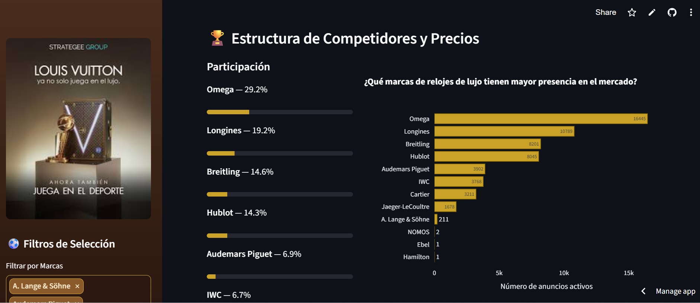
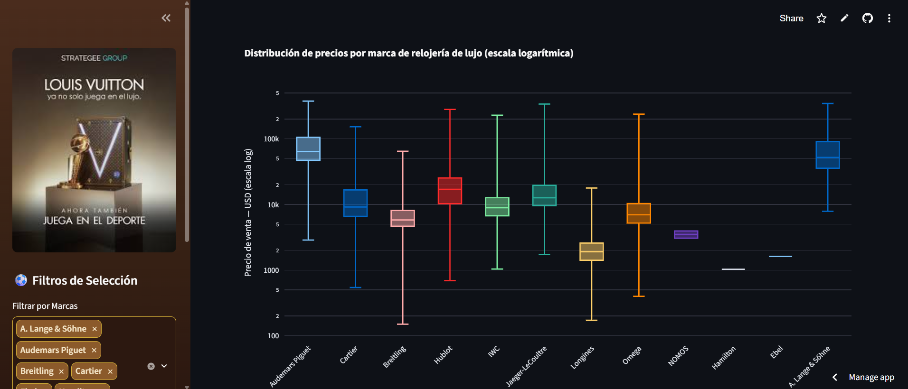
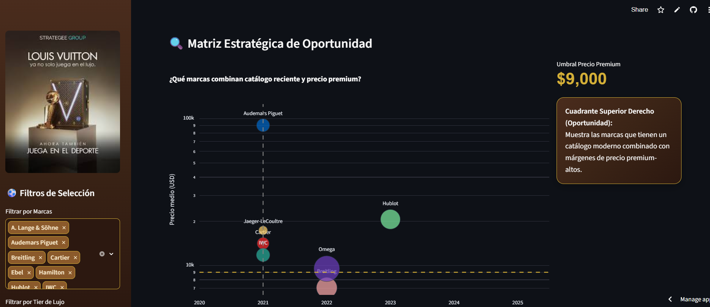
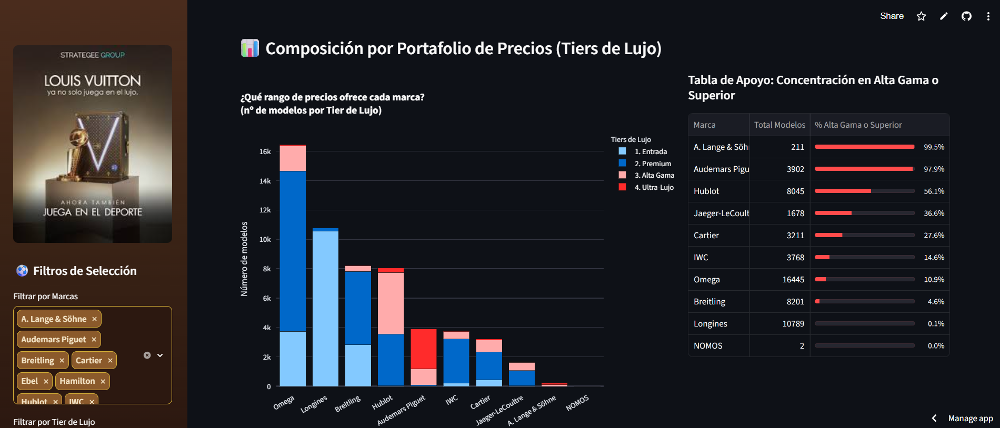
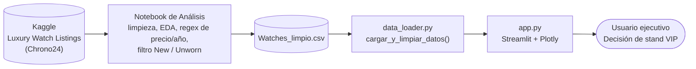

<div align="center">

# ⚽ Mundial Luxury Stands
### Cuadro de Mando Estratégico para Activaciones VIP de Relojería de Lujo — Mundial 2026

[](https://www.python.org/)
[](https://streamlit.io/)
[](https://plotly.com/)
[](https://pandas.pydata.org/)
[](#-licencia)

*Dashboard ejecutivo que traduce datos brutos de reventa de relojería de lujo en una recomendación de marca para activaciones de marketing en zonas VIP de los estadios del Mundial 2026.*

[Contexto](#-contexto-y-problema-de-negocio) · [Funcionalidades](#-funcionalidades-clave) · [Arquitectura](#-arquitectura-del-proyecto) · [Sesgos](#%EF%B8%8F-gobernanza-y-sesgos-documentados) · [Instalación](#-instalación-y-uso) · [Checklist](#-cumplimiento-del-checklist-del-proyecto)

</div>

---

## 🌍 Contexto y Problema de Negocio

El Mundial 2026 se disputará en sedes de **Estados Unidos, México y Canadá**, y reunirá a uno de los públicos VIP más adinerados del calendario deportivo mundial. Sin embargo, al auditar la lista oficial de patrocinadores, se detecta un hueco de mercado claro: **ninguna marca de relojería de lujo, espirituosos premium o automoción de alta gama figura como patrocinador oficial** (la automoción está cubierta por una marca generalista, y las bebidas por marcas de consumo masivo).

Este proyecto nace para responder una pregunta de negocio muy concreta:

> **¿Qué marcas, modelos y rangos de precio de relojería de lujo representan la mejor oportunidad de posicionamiento de marca en una zona VIP de estadio, dado que ninguna casa relojera es actualmente patrocinadora oficial?**

El dashboard convierte un dataset de reventa de relojes de lujo en una herramienta de decisión ejecutiva: sin código, sin hojas de cálculo densas, con alertas explícitas sobre los límites de los datos antes de comprometer presupuesto.

---

## ✨ Funcionalidades Clave

### 🏆 Pestaña 1 — Presencia y Participación
KPIs ejecutivos (marcas activas, anuncios filtrados, precio mediano de mercado), un ranking de cuota de mercado por marca con barras de progreso, y un análisis de dispersión de precios por marca en escala logarítmica — pensado para comparar marcas con rangos de precio muy distintos sin que las más accesibles queden visualmente aplastadas.

### 📐 Pestaña 2 — Análisis de Cuadrantes
Un mapa de oportunidad que cruza el año medio de fabricación del catálogo con el precio medio por marca: el cuadrante superior derecho identifica qué marcas combinan catálogo reciente y posicionamiento premium — la combinación ideal para una activación VIP. El tamaño de cada burbuja representa el volumen de modelos disponibles (peso muestral).

### ⚖️ Pestaña 3 — Sesgos y Mitigación
Una sección de gobernanza explícita (no una nota técnica al pie) con los 3 sesgos metodológicos detectados en el dataset, su impacto de negocio si se ignoran, y la mitigación propuesta para cada uno. Ver detalle completo en [Gobernanza y Sesgos Documentados](#%EF%B8%8F-gobernanza-y-sesgos-documentados).

### 🎁 Pestaña 4 — Experiencia Premium
Un complemento de storytelling de marca: una propuesta de valor diferencial (grabado personalizado) que ilustra cómo trasladar el análisis de datos a una experiencia tangible para el cliente VIP del estand.

### 🎛️ Filtros Cruzados (barra lateral)
Marca, Tier de Lujo y Material de la caja — los tres filtros se combinan en tiempo real y afectan a todos los gráficos de forma simultánea (interactividad cruzada).

---

## 🖼️ Vista Previa






---

## 🧱 Arquitectura del Proyecto



El proyecto separa con claridad tres responsabilidades: la **exploración y limpieza profunda** vive en el notebook de análisis (Google Colab), el **pipeline de transformación reutilizable** vive en `data_loader.py`, y la **capa de presentación e interactividad** vive en `app.py`. Esto permite re-ejecutar la limpieza sin tocar la interfaz, y viceversa.

---

## 🛠️ Stack Tecnológico

| Tecnología | Uso en el proyecto |
|---|---|
| **Python 3.10+** | Lenguaje base de todo el pipeline |
| **Streamlit** | Framework de la interfaz web interactiva, despliegue en la nube |
| **Plotly Express** | Los 4 gráficos interactivos obligatorios (boxplot, barras, scatter, barras apiladas) |
| **Pandas / NumPy** | Limpieza, transformación y agregación del dataset |
| **Regex (`re`)** | Extracción de precios y años de producción desde texto no estructurado |
| **CSS personalizado** | Identidad visual premium (paleta oro/carbón) inyectada vía `st.markdown` |

> **¿Por qué Streamlit y no una herramienta de BI (Power BI/Tableau)?** Permite código modular en Python reutilizando directamente la lógica de limpieza ya validada en el notebook de análisis estadístico, y se despliega de forma gratuita en la nube sin licencias adicionales — la opción más rápida y flexible para un desarrollo individual de pocos días.

---

## 📊 Metodología y Pipeline de Datos

El módulo `data_loader.py` centraliza toda la lógica de calidad del dato, cacheada con `@st.cache_data` para que la app no la recalcule en cada interacción del usuario:

1. **Limpieza de precios** — los precios llegan como texto con símbolos de divisa; una función con expresiones regulares los convierte a valores numéricos (`float`) descartando cualquier carácter no numérico.
2. **Extracción del año de producción (`yop`)** — conversión numérica robusta para evitar que formatos de texto no puros rompan el análisis estadístico posterior.
3. **Filtrado metodológico al mercado objetivo** — se conservan únicamente los anuncios marcados como `New` o `Unworn`, alineando el dataset con el objetivo de negocio (relojería **nueva**, no mercado vintage/coleccionista).
4. **Segmentación en Tiers de Lujo** — variable de negocio calculada automáticamente a partir del precio (ver tabla siguiente), con orden categórico forzado para que los gráficos respeten la jerarquía Entrada → Ultra-Lujo.
5. **Normalización de columnas** — estandarización de nombres (`casem` ↔ `case_material`) para garantizar consistencia entre el dataset de origen y los gráficos.

---

## 💎 Segmentación: Tiers de Lujo

| Tier | Rango de precio (USD) | Lectura de negocio |
|---|---|---|
| 1. Entrada | < $5,000 | Volumen y reconocimiento de marca |
| 2. Premium | $5,000 – $15,000 | Equilibrio entre alcance y exclusividad |
| 3. Alta Gama | $15,000 – $50,000 | Posicionamiento aspiracional fuerte |
| 4. Ultra-Lujo | > $50,000 | Pieza de conversación para el espacio VIP más exclusivo |

---

## ⚖️ Gobernanza y Sesgos Documentados

Antes de recomendar presupuesto sobre estos datos, se documentan de forma explícita tres limitaciones metodológicas:

### 🌎 Sesgo geográfico — *Impacto alto*
Los datos provienen de Chrono24, un marketplace cuyos vendedores se concentran mayoritariamente en Europa y EE.UU.; **México y Canadá están subrepresentados o ausentes**, pese a ser sedes oficiales del Mundial 2026.
**Mitigación:** complementar con paneles de consumo de lujo locales (Statista, Euromonitor) y validar la shortlist de marcas con un piloto de bajo coste antes de comprometer presupuesto completo en esas sedes.

### 🏷️ Precio de reventa, no PVP oficial — *Impacto medio*
Los precios reflejan el mercado secundario, no el precio de catálogo oficial de cada marca.
**Mitigación:** usar estos precios solo como proxy de posicionamiento relativo entre marcas, nunca como base de presupuesto final; contrastar con el PVP oficial antes de firmar cualquier acuerdo.

### 🔍 Sesgo del filtro "solo nuevos" — *Impacto medio-alto*
Al limitar el análisis a `New`/`Unworn`, el ranking puede penalizar a casas relojeras que distribuyen su producto nuevo casi en exclusiva a través de boutique propia (poco presentes en canales de reventa), aunque sean líderes reales del mercado.
**Mitigación:** cruzar el ranking del dashboard con cuota de mercado oficial del sector (informes de grupos como Richemont, Swatch Group, LVMH) antes de descartar cualquier marca candidata.

---

---

## 🚀 Instalación y Uso

**Requisitos previos:** Python 3.10 o superior.

```bash
# 1. Clona el repositorio
git clone https://github.com/Mary1922/mundial-luxury-stands.git
cd mundial-luxury-stands

# 2. Instala las dependencias
pip install -r requirements.txt

# 3. Ejecuta el dashboard
streamlit run app.py
```

La aplicación se abrirá automáticamente en `http://localhost:8501`.

**🔗 Demo en vivo:** _[https://mundialluxurystands-mmwpatmpsbcsqxta2ytegu.streamlit.app/]_

---

## 📁 Estructura del Repositorio

```
mundial-luxury-stands/
├── app.py                # Aplicación principal: UI, CSS premium, lógica de gráficos
├── data_loader.py        # Pipeline de limpieza, transformación y reglas de negocio
├── requirements.txt      # Dependencias del proyecto (Streamlit, Pandas, NumPy, Plotly)
├── Watches_limpio.csv    # Dataset ya limpio (ver fuente original más abajo)
├── Pictures/              # Activos visuales: logo, imagen del stand, detalle premium
└── README.md              # Este documento
```

---

## 🔗 Dataset y Fuentes

- **Dataset original:** [Luxury Watch Listings — Kaggle](https://www.kaggle.com/datasets/philmorekoung11/luxury-watch-listings) (scraping de anuncios de Chrono24).
- El dataset se procesó y limpió en un notebook de análisis exploratorio (Google Colab) antes de su uso en este dashboard; ver sección [Metodología](#-metodología-y-pipeline-de-datos).

---

## ✅ Cumplimiento del Checklist del Proyecto

| Bloque del checklist | Dónde se cumple |
|---|---|
| **I. Exploración y preparación del dato** | `data_loader.py` (limpieza de precios, años, duplicados) + notebook de análisis |
| **II. Análisis estadístico y lógica de negocio** | Pestañas 1 y 2 (medidas de tendencia central, dispersión, matriz de oportunidad) |
| **III. Sesgos y gobernanza** | Pestaña 3 — [Gobernanza y Sesgos Documentados](#%EF%B8%8F-gobernanza-y-sesgos-documentados) |
| **IV. Visualización e interactividad** | 4 gráficos Plotly interactivos + filtros cruzados en tiempo real (marca, tier, material) |
| **V. Presentación oral** | Guion de 7 minutos apoyado en este dashboard (contexto → demo en vivo → recomendaciones) |

---

## 🗺️ Roadmap / Próximas Mejoras

- Incorporar datos de demanda local de México y Canadá si aparecen fuentes públicas fiables.
- Exportar un resumen ejecutivo en PDF directamente desde el dashboard.
- Añadir un quinto gráfico de evolución temporal si se ampliara el dataset con series históricas.

---

## 👤 Autora

**María Roldán Martínez** — Consultora de Datos e IA · Bootcamp IA, Python, Machine Learning & SQL
[LinkedIn](https://www.linkedin.com/in/mariaroldan/) · [GitHub](https://github.com/Mary1922)

---

## 📄 Licencia

Este proyecto se distribuye bajo licencia MIT. Eres libre de adaptarla a la licencia que prefieras antes de publicar el repositorio.

---

## 🤝 Contribuciones

Este proyecto es una herramienta de análisis comercial desarrollada de forma individual para un Bootcamp. Si quieres proponer una mejora:

1. Haz un *fork* del proyecto.
2. Crea una rama para tu funcionalidad (`git checkout -b feature/nueva-mejora`).
3. Haz *commit* de tus cambios (`git commit -m 'Añadida nueva funcionalidad'`).
4. Abre un *Pull Request*.

<div align="center">

*Desarrollado con rigor técnico y elegancia analítica para la toma de decisiones premium.* ⌚⚽

</div>
